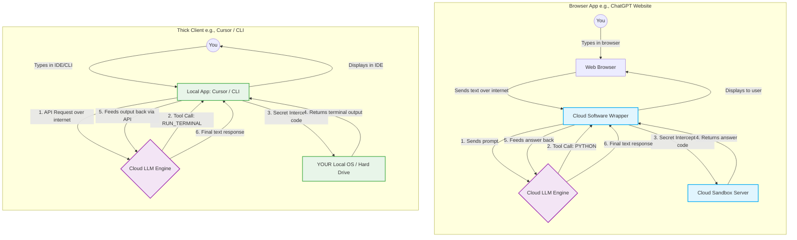

# Week 1, Day 2: AI Basics & How It Actually Works

## 1. What is an LLM (Large Language Model)?

Think of an LLM (like GPT) as a super-powered version of the "autocomplete" feature on your phone's keyboard. It has read almost everything on the internet to learn how humans talk, so it is very good at guessing what word comes next.

* **Tokens (How it reads):** The AI does not read whole words. It chops words into smaller pieces called **tokens** (sometimes a whole word, sometimes just a few letters).
* **Probability (How it guesses):** It does not just pick the single best word. It gives a score to *every* possible next word. For the phrase "Two plus two is", the word "four" gets a nearly 100% score, and the word "banana" gets a 0% score.
* **The Loop (How it writes):** The AI only writes **one piece at a time**. It reads your prompt, guesses the first word, adds it to your prompt, and then reads the whole thing again to guess the second word.

### The Complete Inference Loop

Here is a table showing how the AI loops your text to generate the answer step-by-step:

| Step | What the AI Reads (The Input Sequence) | What the AI Guesses Next |
| --- | --- | --- |
| 1 | "What is the capital of France?" | "The" |
| 2 | "What is the capital of France? The" | "capital" |
| 3 | "What is the capital of France? The capital" | "of" |
| 4 | "What is the capital of France? The capital of" | "France" |
| 5 | "What is the capital of France? The capital of France" | "is" |
| 6 | "What is the capital of France? The capital of France is" | "Paris." |

---

## 2. The Engine vs. The Car (LLMs vs. AI Apps)

People often confuse the AI brain with the website they are using. It is important to know the difference.

| Concept | What it is | Easy Example | Real World Example |
| --- | --- | --- | --- |
| **LLM (The Brain)** | Just the raw math program that predicts the next word. It does nothing else. | The car engine | GPT, Claude |
| **AI Application (The Product)** | The full software built around the brain. It adds a chat box, buttons, memory, and internet search. | The whole car (seats, steering wheel) | ChatGPT, Cursor Agent |

---

## 3. The Four Software "Tricks" That Make AI Look Smart

The raw AI brain is actually pretty basic. To make it feel like you are chatting with a smart human or a capable assistant, developers use software tricks.

### Trick 1: The "Goldfish Memory" Trick

* **The Problem:** The raw AI brain is totally stateless. Every time you ask a question, it is meeting you for the first time.
* **The Trick:** The website (like ChatGPT) secretly copies your *entire past conversation* and pastes it into every new message you send.

> **The "Hi, I'm Ed" Example:**
> If you just used the raw brain and said, "Hi, I'm Ed," it would say "Hello, Ed." If your next message was just "Who am I?", the AI would say "I don't know," because it forgot the first message.
> But ChatGPT tricks the brain by silently sending: *"User: Hi I'm Ed. AI: Hello Ed. User: Who am I?"* all at once. The AI reads that whole script and easily guesses "You are Ed."

### Trick 2: The "Thinking Out Loud" (Reasoning) Trick

* **The Concept (No Inner Voice):** Unlike humans, an AI cannot pause and "think silently" in its head to crunch numbers. It can only generate text based on the exact sequence of words currently fed into its memory (often called the "context window").
* **The Problem:** If you ask a tricky math or logic question and force the AI to answer immediately, it has to rely on a blind instinct. It will usually blurt out the most common, statistically obvious answer (which is often wrong).
* **The Trick ("Chain of Thought"):** Originally, users would literally add the phrase "please think step-by-step" to their prompts. Now, the creators of the LLMs train the models to automatically output sentences explaining their logic directly into the chat text *before* generating the final answer.
* **Why it Works (The "Scratch Paper" Effect):** The AI does not have eyes to "read a screen." Instead, its engine re-processes the *entire text of the conversation* every time it needs to guess the next single word. By typing out its logic first, the AI creates a trail of text (like scratch paper). It feeds its own freshly typed logic back into its engine on every loop, which mathematically steers its "autocomplete" away from a blind guess and toward the correct conclusion.

> **The Coin Toss Example:**
> **Question:** You toss two coins. One is heads. What are the chances the other is tails?
> * **Without the trick (Instant Guess):** The AI sees the words "coin toss" and immediately blurts out **1/2** because 50/50 is the most common association with coins on the internet.
> * **With the trick (Using Scratch Paper):** The AI is forced to output its steps into the chat:
> 
> 
> 1. It generates: *"The possible outcomes for two coins are HH, HT, TH, and TT."*
> 2. It processes that new text, applies the rule, and generates: *"We know at least one is heads, so TT is impossible. That leaves HH, HT, and TH."*
> 3. It processes *that* new text, and generates: *"Out of those 3 options, 2 of them (HT and TH) contain a tails."*
> 4. **The Final Answer:** Now, the AI must guess the final answer. Because the words *"2 out of 3"* are sitting right there in the text it just generated, its engine is mathematically forced to predict **2/3**.
> 
> 

### Trick 3: The "Manager with No Hands" (Tool Calling)

* **The Problem:** The raw AI brain cannot "do" anything. It cannot open a browser, it cannot calculate math, and it cannot save a file. It only predicts words. If you ask it a hard math question like "What is the square root of Pi?", its autocomplete engine will probably just guess a wrong number.
* **The Metaphor:** Imagine a brilliant Manager locked in an empty room. They have no computer, no calculator, and no internet. They only have a notepad to slide notes under the door to you (the AI software wrapper standing outside the room).
* **The Trick:** You slide a rule under the door: *"Hey Manager, if you ever need to do math, don't guess. Just write `PYTHON: [math problem]` and slide it back to me. I will use my calculator, find the answer, and slide it back to you."*
* **How it Works in Practice (Browser vs. Thick Client):** Where this code actually executes depends entirely on the architecture of the application wrapper you are using.

#### 1. The Browser Setup (e.g., ChatGPT.com)

* **Where the Wrapper lives:** On OpenAI's cloud servers.
* **How it works:** Your web browser is just a display terminal. When you ask "What is the square root of Pi?", the AI generates the token: `PYTHON: import math; math.sqrt(math.pi)`. The software wrapper running on OpenAI's servers catches this token, pauses the AI, and executes the script in a locked-down, secure cloud "sandbox" environment on *their* computers (not your local laptop). It gets the result (`1.772`) and slides it back into the AI's context window so it can write out the final answer to you.

#### 2. The Thick Client Setup (e.g., Cursor, VSCode, Terminal CLI)

* **Where the Wrapper lives:** Installed directly on *your local computer*.
* **How it works:** Applications like Cursor are local software wrappers. They send your prompt across the internet to the cloud LLM. But when the cloud LLM returns a tool command (like `WRITE_FILE` or `RUN_TERMINAL`), the local app intercepts it and executes that instruction directly on **your computer's operating system and local hard drive**. This is what gives programming tools the power to read your files, edit your codebase, and compile systems directly on your machine.

#### Architecture Diagram: The Secret Intercept

* **The Pro Takeaway:** The LLM itself *never used a tool*. It just used its autocomplete engine to generate a text request, and the software wrapper did the actual work—either in the cloud or on your local system.

### Trick 4: The "Are We There Yet?" Trick (The Loop)

* **The Problem:** Asking the AI to do a massive task in one single prompt usually fails. It gets confused or stops halfway.
* **The Trick:** Instead of calling the LLM once and hoping for the best, the software wrapper calls the LLM in a continuous loop.
* **How it Works:** The software asks the AI to take *one* step. Once the AI outputs that step, the software automatically asks: "Are you finished yet?" If the AI says no, the software feeds the progress back into the engine and runs it again. It loops infinitely until the AI finally says the goal is complete.

---

## 4. Advanced Theory: The Mechanics of AI Reasoning

To master AI coding, you must understand how to manipulate the model's prediction engine. The "Thinking Out Loud" trick is professionally known as **Chain of Thought (CoT) Prompting**.

### Pro Terminology: How the Engine Actually Runs

When we say the AI "reads the screen," what is mathematically happening is called **Autoregressive Generation**.

* **The Context Window:** This is the AI's working memory for a single session. It is the exact sequence of tokens (your prompt plus everything it has generated so far) that is fed into the neural network.
* **Autoregressive Generation:** LLMs use their own previous output as input for future predictions.
* **The Mechanism:** The AI cannot look ahead, and it cannot edit what it just wrote. It calculates the probability of the next token strictly based on the current state of the Context Window. If the Context Window lacks logical steps, the probability of generating the correct final answer is incredibly low.

### A Classic Example: The Bat and Ball Problem

To see why Autoregressive Generation fails without Chain of Thought, look at this famous test of cognitive reflection:

> **The Prompt:** "A bat and a ball cost $1.10 in total. The bat costs $1.00 more than the ball. How much does the ball cost?"

* **Scenario A: Zero-Shot Prompting (Instant Guess)**
If you ask the model to just answer the question, its engine looks at the tokens `$1.10` and `$1.00`. The highest probability statistical association between those numbers is simple subtraction.
*The Output:* "The ball costs $0.10."
*The Reality:* If the ball is `$0.10`, and the bat is `$1.00` *more* than the ball (`$1.10`), the total would be `$1.20`. The AI failed because it relied on statistical instinct instead of math.
* **Scenario B: Chain of Thought Prompting (Reasoning)**
If you force the model to output the algebraic steps first, the autoregressive engine is forced to evaluate the logic token-by-token.
*The Output:*

1. Let $b$ be the cost of the ball and $B$ be the cost of the bat.
2. We know the total is `$1.10`: $B + b = 1.10$
3. We know the bat is `$1.00` more than the ball: $B = b + 1.00$
4. Substitute $B$ into the first equation: $(b + 1.00) + b = 1.10$
5. Combine terms: $2b + 1.00 = 1.10$
6. Subtract `$1.00`: $2b = 0.10$
7. Divide by 2: $b = 0.05$

*The Reality:* By the time the AI needs to generate the final answer, the token `0.05` is mathematically the only possible next token. The AI solved it correctly because we forced the Context Window to contain the proof.

### Why This Matters for AI Coders

As you progress in your course to building AI Agents, you will apply this mechanic to writing software.

If you ask an AI: *"Write a Python script to scrape a website, parse the data, and save it to a database."*

* **Without CoT:** The AI instantly starts writing code. It will likely hallucinate variables, forget dependencies, and write a buggy script because it is guessing the code token-by-token without a plan.
* **With CoT:** You prompt the AI: *"Before writing any code, outline the architecture, list the necessary Python libraries, and define the data schema."* The AI generates a text plan. When it finally writes the code, it uses that generated plan inside its Context Window as a rigid blueprint, resulting in functional, bug-free code.

---

## 5. What is an AI Agent? (The Winning Definition)

Because "AI Agent" became a massive buzzword, the definition kept changing. Over time, it evolved from "a system that does work independently" (OpenAI's early definition) to "an LLM that controls a workflow" (Hugging Face / Anthropic).

However, as an AI Coder, the modern, widely accepted definition you need to know is:

> **An AI Agent is an LLM that runs TOOLS in a LOOP to achieve a GOAL.**

### Deconstructing the Cursor Agent Example

If you tell an AI coding app like Cursor: *"Build me a first-person shooter game in a web page,"* here is how it uses all the foundational tricks to become an "Agent":

| Component | What is actually happening? |
| --- | --- |
| **The Goal** | You provided the prompt: "Build a first-person shooter." |
| **The Tools (Trick 3)** | The LLM generates text asking the software to use tools (e.g., `WRITE_FILE: index.html`, or `RUN_TERMINAL: npm start`). |
| **The Loop (Trick 4)** | The software executes the tool, feeds the result back to the LLM, and asks, "Is the game done?" The LLM loops again and again, writing code file by file, until the game is finished. |

---
