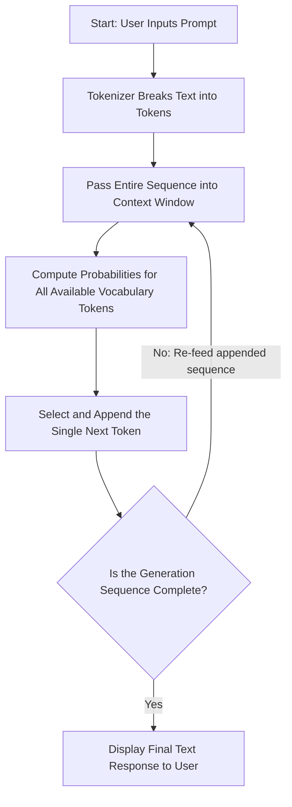
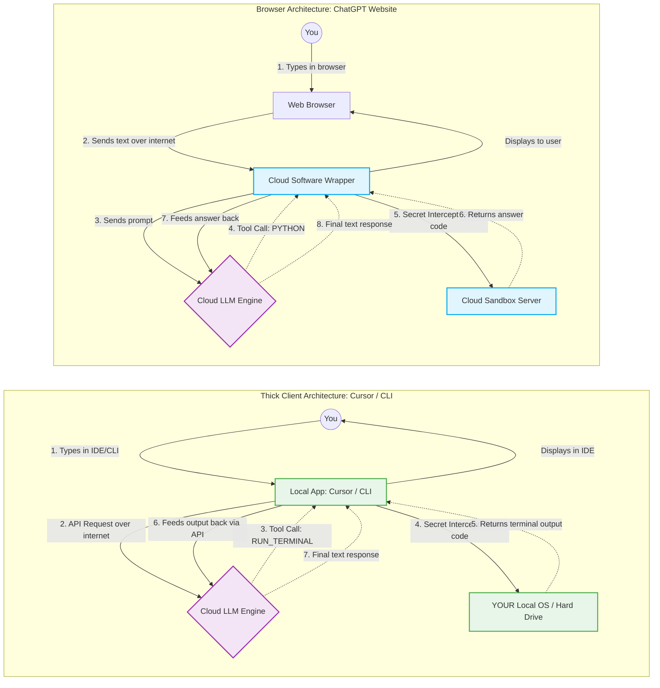

# Week 1, Day 2: AI Basics & How It Actually Works

## Overview

This chapter covers the core mechanics of Large Language Models (LLMs) and how software wrappers turn simple text prediction engines into intelligent-seeming applications. It dismantles the common misconception that an AI has native memory, reasoning capabilities, or direct access to computing tools, explaining the specific programming "tricks" used to create modern AI applications and agents.

---

## Why This Matters

To build high-performance AI coding agents or debug complex software automation workflows, you cannot treat the AI as a magical black box. Understanding that LLMs are stateless, token-based probability engines allows you to manipulate their outputs intentionally. By understanding how software wrappers intercept text to trigger tools or append context histories, you gain full control over structural code generation and prevent catastrophic logic degradation.

---

## Key Concepts

* **Autoregressive Generation:** The foundational mathematical loop where an LLM reads an input string, predicts exactly one token at a time, appends that token to the input string, and processes the new sequence over again.
* **Statelessness vs. Illusion of Memory:** The core property where a raw model holds zero architectural knowledge of past transactions, requiring software wrappers to inject conversation backlogs dynamically.
* **Chain of Thought (CoT):** Forcing the model's text generation to map intermediate logical steps into its context window, mechanically shifting token probabilities toward accurate results.
* **Tool Interception (Text-to-Action Protocol):** Parsing specific text patterns generated by an autocompletion engine to halt the model, run code via sandboxes or local operating systems, and slide the output back to the model.
* **The Agent Paradigm:** An architectural loop combining goals, tools, and continuous execution chains until an end criteria evaluates to true.

---

## Detailed Notes

### Concept 1: Large Language Models & Token-Based Inference

**Simple Explanation**
An LLM is a giant autocomplete engine like the one on your smartphone's keyboard, just incredibly advanced. It does not read entire words or understand them like a person. Instead, it breaks text down into small fragment pieces called tokens. When you type an input phrase, the model calculates a probability percentage score for every single possible token in its dictionary to guess which piece of text should appear next.

**Technical Explanation**
Large Language Models are deep neural networks trained on massive corpora to compute conditional token probabilities. Input text strings are parsed via a tokenizer into numerical representations (tokens). Given an input sequence $S = \{t_1, t_2, ..., t_n\}$, the core transformer network evaluates the joint probability distribution to predict the vector distribution of the next token $t_{n+1}$. The model does not choose answers by intuition; it computes statistical maximum-likelihood text outputs over its vocabulary space.

**Example**
For the input sequence "Two plus two is", the token matching "four" receives a mathematical score near 100%, whereas the token matching "bananas" receives a score approaching 0%.

**Analogy**
Think of an LLM as an incredibly fast library clerk typing on a typewriter who can only look through a glass window at the page so far. They cannot think ahead or edit past characters; they simply look at what is written on the page right now and tap out the single most likely character that should follow it based on every book they have ever cataloged.

---

### Concept 2: The Core Software Architecture (The Engine vs. The Car)

**Simple Explanation**
People often confuse the AI's core brain with the app or website they are using. The raw LLM itself is just an unmoving math engine that sits waiting for text input. The website or application you interact with is a separate program built on top of that engine. It adds the interface, buttons, chat windows, memory systems, and web search bars to make the math engine easy to use.

**Technical Explanation**
An LLM functions as an un-compiled, stateless inference engine exposed via an API gateway or local weight file. An AI Application represents the surrounding wrapper layer (the Orchestration and Client UI layer). The application captures raw user interactions, manages programmatic state, decorates text schemas via system messaging, intercepts model token outputs, executes internal software logic, and translates mathematical generation streams into operational consumer interfaces.

**Example**
GPT and Claude are raw foundational AI models (the underlying engine layers). ChatGPT and Cursor Agent are consumer AI applications (the full cars wrapping around those engines).

**Analogy**
The LLM is a high-performance car engine sitting on a factory crate. It is incredibly powerful, but it cannot drive down the street by itself. The AI Application is the actual car body built around it—complete with the chassis, fuel lines, steering wheel, and leather seats that let a human driver control that engine.

---

## Workflow

This flowchart maps the internal step-by-step cycle of an autoregressive inference string generation.

---

## Architecture Diagram

### Browser Setup (e.g., ChatGPT) vs. Thick Client Setup (e.g., Cursor)

---

## Step-by-Step Process

### The Programmatic Mechanics of the Tool-Interception Protocol

1. **System Prompt Injection:** The application wrapper initiates a session by sending hidden system parameters telling the LLM: `"You have access to a tool suite. To run calculations or modify local scripts, stop normal prose generation and output precisely: TOOL_NAME: [arguments]." `
2. **User Evaluation Request:** The user prompts the agent platform with a task that requires system execution (e.g., checking directory sizes or running automated unit tests).
3. **Token Trigger Extraction:** The foundational model reads the context space, recognizes it lacks the static training parameters to answer, and responds by generating the exact string: `RUN_TERMINAL: npm test`.
4. **Programmatic Interception:** The local wrapper client reads the inbound token chunks in real-time, matches the text pattern to a known execution hook, and pauses the LLM inference loop.
5. **Local Operating System Execution:** The software client executes the intercepted terminal command natively on the developer's computer or inside a secure cloud container.
6. **Context Re-Injection:** The software client reads the resulting console output buffer and inserts it directly back into the LLM's active memory workspace.
7. **Final Assembly:** The model parses its updated context string (which now contains the real-world output data) and safely generates the final conversational response back to the client console.

---

## Commands and Examples

### Step-by-Step Autoregressive Loop Tracing

This visualization models how the raw context window grows token-by-token during an inference cycle:

| Step | Current Inbound Context Window Array (Input Sequence) | Next Token Prediction Target |
| --- | --- | --- |
| 1 | `["What", "is", "the", "capital", "of", "France?"]` | `"The"` |
| 2 | `["What", "is", "the", "capital", "of", "France?", "The"]` | `"capital"` |
| 3 | `["What", "is", "the", "capital", "of", "France?", "The", "capital"]` | `"of"` |
| 4 | `["What", "is", "the", "capital", "of", "France?", "The", "capital", "of"]` | `"France"` |
| 5 | `["What", "is", "the", "capital", "of", "France?", "The", "capital", "of", "France"]` | `"is"` |
| 6 | `["What", "is", "the", "capital", "of", "France?", "The", "capital", "of", "France", "is"]` | `"Paris."` |

---

## Best Practices

* **Provide Logical Scratch Paper:** Always structure complex engineering prompts to demand that the model outline architectural boundaries and variable schemas *before* writing any code blocks.
* **Isolate Execution Sandbox Paths:** Ensure that thick client applications (like Cursor or CLI extensions) run inside verified, containerized workspace environments to prevent untrusted file modifications.
* **Acknowledge Context Size Budgets:** Be mindful that appending massive conversation backlogs into the context window to simulate memory will scale token consumption overhead linearly.

---

## Common Mistakes

* **Assuming Real-Time Memory Retention:** Believing the raw foundational model tracks historical configurations between isolated sessions. If you do not pass back logs of previous interactions, the model starts from blank states.
* **Expecting On-the-Fly Logic Corrections:** Forcing an AI model to build complex scripts without using intermediate planning strings. This forces it to blindly guess immediate syntax structures token-by-token without an underlying plan.
* **Confusing Browser-Side Sandboxes with Local Execution:** Assuming local desktop tools operate within a safe, isolated cloud server like basic web portals. Desktop coding plugins execute code commands directly on your physical operating system.

---

## Pro Tips

* **Chain-of-Thought Steering:** If an agent tool fails to construct proper scripts, append explicit parameters like: `"Think systematically. Map out all module dependencies in text steps before generating any structural file writes."` This forces the model's text window to steer away from statistical noise and focus on factual code generation.
* **The Intercept Hack:** You can build lightweight custom tools by writing short shell scripts that search for unique output patterns generated by your model's text responses.

---

## Real-World Use Cases

* **Duolingo Max Frameworks:** Utilizing system wrappers built around foundational LLMs to create responsive, natural conversational interfaces for real-time human language learning.
* **Atlassian Robo Implementations:** Injecting software engineering issue trackers, historic project documentation, and corporate code bases into active model contexts to automatically diagnose workspace issues.
* **Cursor Agent Environments:** Converting raw predictive text outputs into local file systems tools capable of scanning directories, building games, and running terminal compilations dynamically on a developer's computer.

---

## Key Takeaways

* **LLMs are Autocomplete Systems:** Foundational models only calculate mathematical probability chains to output individual tokens one at a time.
* **Memory is an Illusion:** Applications maintain consistency by silently bundling past text histories with every new prompt you type.
* **Tools Use Text Controls:** Models don't open applications or compile scripts directly; they write text commands that software wrappers catch and execute.
* **Agents link Goals, Loops, and Tools:** A modern AI engineering agent is built by combining a model with an active execution loop, strict goal conditions, and functional tooling wrappers.

---

## Glossary

* **Token:** A base fragment string of characters used by neural models as the standard element for processing text entries.
* **Inference:** The runtime process where a trained mathematical model parses active inputs to compute and predict output states.
* **Context Window:** The absolute scale of token space a model can maintain in active operational memory for a single calculation pass.
* **Statelessness:** A computing design model where a program stores zero data histories across separate operational transactions.
* **Thick Client:** A software application installed locally on a computer's physical operating system that processes data inputs locally instead of relying completely on cloud servers.

---

## Revision Notes

### The Core AI Engine Blueprint

* **The Raw Model:** Completely stateless, zero independent memory, calculates statistical maximums for token outputs.
* **The App Wrapper:** Manages dialogue histories, injects target guidelines, and catches tool strings.
* **The Logic Factor:** Models cannot think internally. They use freshly generated text strings within their active workspace as "scratch paper" to accurately calculate complex final math or programming steps.

---

## Interview Questions

### Q1: Explain why providing an LLM space to output its intermediate logical steps changes the actual probability distribution of its final answer.

**Answer:** Because LLMs generate text via autoregressive prediction, calculating the next token based entirely on the strings currently present within their context window. If a model tries to output an answer instantly, it relies on immediate statistical distributions found in its training data. By writing down its logical steps first, it adds accurate details right into its working memory. The model then evaluates this typed data to accurately guide its autocomplete engine toward the correct conclusion.

### Q2: What exact process allows a purely text-based autocompletion model to modify physical files on a developer's hard drive?

**Answer:** The model does not access physical hard drives directly. Instead, a local software application wrapper scans the model's text generation for unique command structures (e.g., `WRITE_FILE: main.py`). When the wrapper identifies this pattern, it pauses the text generation loop, reads the arguments, uses local system APIs to write the data to the hard drive, and passes the terminal result back into the model's context window.

### Q3: Why does a web-based AI assistant appear to remember your name across multiple chat messages despite being built on a stateless model?

**Answer:** The memory is an illusion managed entirely by the software application wrapper. The raw model does not store history between API calls. To maintain the illusion of memory, the application wrapper stores your chat history and silently repastes the entire conversation string into the context window every single time you submit a new question.

---

## Practice Exercises

### Exercise 1: Tracing the Autoregressive Execution

Take the prompt statement `"The structural framework of an AI Agent requires..."` and construct a step-by-step tracing table modeled exactly after the complete inference loop documentation section. Map out at least 4 subsequent token prediction iterations.

### Exercise 2: Building a Tool Intercept Prompt

Draft a structured system prompt that commands a raw foundational model to behave like an automated database cleaning script. Define an explicit text token pattern that the model must output whenever it needs to safely request a hard-delete tool execution from the application wrapper.
