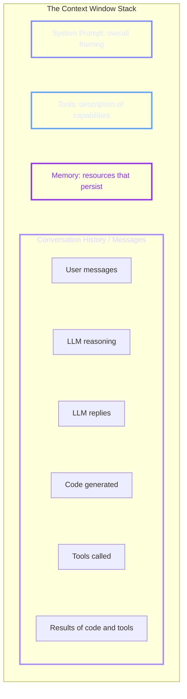
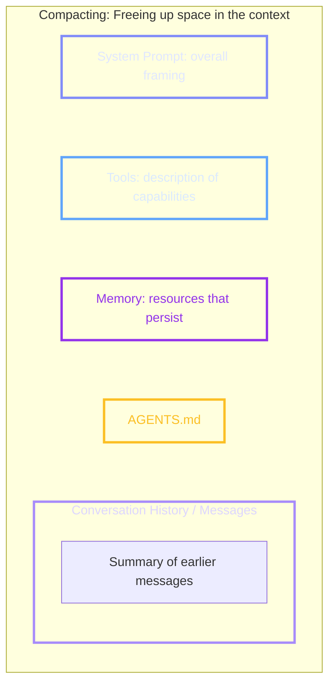

# Week 1, Day 2 (Part 2): Context Engineering & Memory Architecture

Possibly the single most popular expression in the AI engineering world last year was **Context Engineering**. Because Large Language Models (LLMs) are entirely stateless, they rely exclusively on the input you provide to generate the most likely following tokens.

A couple of years ago, "Prompt Engineering" was a dedicated job title focused simply on figuring out the best way to ask an LLM a question. Today, that concept has evolved into Context Engineering. This discipline recognizes that success is not just about the prompt itself; it is about architecting all the surrounding tools, rules, and memory that give the LLM the exact right information to achieve your goal.

---

## The Anatomy of the Context Stack

To engineer context properly, you must understand all the different components that are packaged together to form the single input sent to the LLM.

#### Native Markdown Backup Diagram (Dark Theme Optimized):

---

## Real-World Example: Building a .NET Microservice

Here is the exact breakdown of the context layers alongside a concrete, step-by-step example of what specific instructions go into each layer when building a **.NET Microservice**:

### Layer 1: The System Prompt

* **What it is:** The most crucial, general information at the very beginning of the input that frames the overall situation.
* **Purpose:** It defines the exact role the LLM is playing (e.g., an agent responsible for writing code, or a customer support agent for an airline), the overall job, the tone it should take, and the approach it should use.
* **Microservice Instruction Example:**
> *"You are an elite backend software engineer specializing in C# and .NET 8. Your objective is to build high-performance, scalable microservices. You must write clean, asynchronous C# code, utilize dependency injection strictly, use structured routing architectures, and always communicate your architectural decisions clearly before generating code."*

### Layer 2: Tools

* **What it is:** A set of descriptions detailing the different capabilities and actions the LLM has access to. *(Note: Some developers consider tool descriptions to be a definitional part of the System Prompt itself; it doesn't particularly matter if you think of them as the same thing or two separate chunks, it is just about how you label it).*
* **Purpose:** It teaches the LLM that if it outputs specific tokens (like the word "Python" followed by code), the surrounding software wrapper will interpret those tokens, execute that action on our behalf, and return the results to it during a second call.
* **Microservice Instruction Example:**
> *"You have access to the `dotnet_cli` tool. If you need to add a NuGet package, output the command `dotnet add package [PackageName]`. You also have access to `ef_core_migrations`. Use this tool to execute `dotnet ef database update` when database schemas change."*

### Layer 3: Memory

* **What it is:** Information designed to persist across potentially multiple different conversations, sometimes referred to as long-term or medium-term memory.
* **Purpose:** To store general resources and global configurations that might change over time, but that the agent should always be able to return and reference.
* **Microservice Instruction Example:**
> *"Global Engineering Standards: All microservices in this organization must use Serilog for structured logging. Databases must use PostgreSQL via Entity Framework Core. Authentication is always handled via standard JWT bearer tokens validated against Azure Active Directory."*

### Layer 4: Conversation History / Messages

* **What it is:** The massive block of text that creates the "illusion of memory". Because the LLM is completely stateless, every single interaction so far must be squeezed into the context next.
* **Components Included:**
* User messages.
* LLM reasoning tokens (the tokens it generates to describe its thought process).
* LLM replies.
* Code generated by the LLM.
* Tools the LLM decided to call.
* Results and outputs returned from those code and tool executions.

* **Microservice Execution Log Example:**
* **User Prompt:** *"Create the `Product` domain entity and compile it."*
* **LLM Reasoning:** *"I need to create a C# record or class for the Product entity with standard properties like Id, Name, and Price, ensuring it maps cleanly to EF Core."*
* **Generated Code Response:** `public class Product { public Guid Id { get; set; } public string Name { get; set; } public decimal Price { get; set; } }`
* **Tool Execution:** The wrapper intercepts a request to run `dotnet build`.
* **Tool Return Result:** `Build succeeded. 0 Warning(s). 0 Error(s).` All of this history is combined to frame the next token calculation.

---

## The Project Memory File: `agents.md`

In addition to the standard memory layer, coding agents utilize a special, dedicated file that gets shoved into the context every single time.

* **Generic Name:** `agents.md`.
* **Claude Code:** `claude.md`.
* **Antigravity (Google):** `gemini.md`.

This file is a persistent resource that describes special things about the specific project you are working on, particular coding standards, or things about your objective that you want to be in the memory of the AI agent while it is writing code for us. While it is more complicated than sending it "every single time," consider it to be every single time for now.

* **Microservice Configuration Example inside `agents.md`:**
> *"Project Context: Inventory Management Microservice. Architecture: Clean Architecture. All domain entities must reside inside the `Inventory.Domain` project layer. All database context setups must map inside `Inventory.Infrastructure`. All REST endpoints must be Minimal APIs defined cleanly in the `Inventory.API` orchestration layer. Use xUnit for all unit testing coverage."*

---

## Context Windows and The "Less is More" Law

Every LLM has a "Context Window Limit"—the maximum number of tokens it can examine in its input in order to predict the next tokens. If you try to pass in more tokens than its maximum context window, it will fail. That is considered a break; it can't handle it, and it will be an error.

### Hard Token Capacity Metrics (2026 Reference)

* **Anthropic Claude 4.5 (Sonnet & Opus):** 200,000 tokens *(About half of GPT)*
* **OpenAI GPT-5.2:** 400,000 tokens
* **Google Gemini (in Antigravity):** 1,000,000 tokens *(Much greater limit)*

### The Degradation of Accuracy Performance

While developers frequently obsess over these maximum limits, the reality is that **performance degrades long before you hit the maximum window size**.

* "Performance" in this sense does not mean processing speed; it refers to the accuracy and quality of the results.
* If you shove too much into the context, you get poorer results, the model starts to lose coherence, and it begins to forget things as you fill up the context more and more.
* Conversely, you tend to get the best performance at the very start of your conversation when the context is super empty and it's only got a little bit to pay attention to.
* It's not a binary choice between "it works" or "it fails." Less is more when it comes to filling up the context.

---

## Context Compacting

To prevent the context window from filling up and causing errors, advanced platforms (like Claude Code) utilize a feature called **Compacting**.

#### Native Markdown Backup Diagram (Dark Theme Optimized):

* **How it Works:** Rather than allowing the LLM to fail, the software detects when the context window is almost filled up. It runs a process that essentially looks back at the whole conversation history, summarizes it, and replaces everything with a little summary of what was there before, freeing up tons of space in the workspace.

### The Developer's Dilemma: Old Guard vs. New Guard

* **The Fear of the Compactor:** Historically, developers deeply mistrusted this process because it changes the game suddenly. We are trusting the LLM to do a good job of figuring out what's important and what's not from the history. Sometimes it doesn't. It misses an important thing we care a lot about that we told it during the conversation. That gets removed during summary, and as a result, the LLM appears to forget something or makes the same mistake twice, which is super frustrating.
* **The Manual Workaround:** Because of this lack of trust—especially if it runs while in the middle of doing a task—many developers (including the instructor) traditionally preferred to manually intervene: they would look at what happened, stop the agent, manually rewrite their `agents.md` file to keep careful note of everything, and start up the agent again fresh.
* **The Modern 2026 Best Practice:** Compacting has gotten significantly better in recent history. As of 2026, there is far less reason to fear the compactor. It does a really fine job of summarizing the conversation history, keeping relevant data, and freeing up space. **Don't be stubborn—trust the compactor out of the box.** Let it manage your context space cleanly.

#### References:
- https://www.udemy.com/course/ai-coder-from-vibe-coder-to-agentic-engineer/learn/lecture/54780267#overview 
