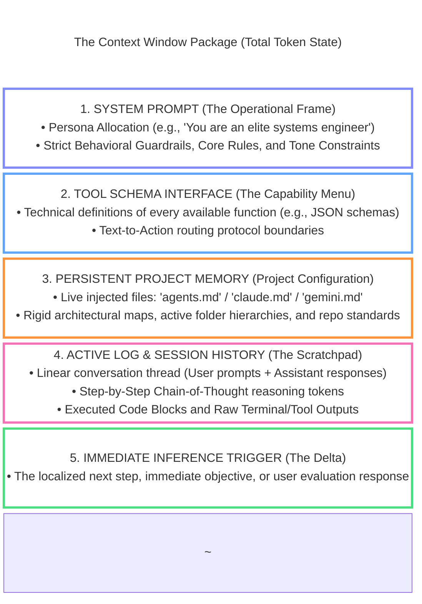
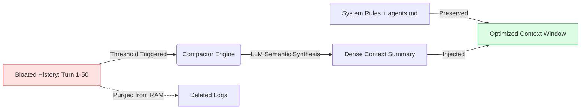

# Week 1, Day 2 (Part 3): Context Engineering & Memory Architecture

## 1. The Paradigm Shift: Prompt vs. Context Engineering

In the early days of generative AI, **Prompt Engineering** was treated as a primary discipline. It focused on the user-facing interface layer: *how* to phrase an isolated instruction to elicit a single text response.

As we transition into building **Autonomous Coding Agents** (such as *Cursor Agent*, *Claude Code*, or *Antigravity*), prompt engineering collapses. Because LLMs are strictly stateless mathematical engines, their output at step 50 of an autonomous loop depends entirely on the total informational ecosystem loaded into the model at that exact millisecond.

Managing this holistic ecosystem is **Context Engineering**.

| Dimension | Prompt Engineering (The Micro View) | Context Engineering (The Macro Architecture) |
| --- | --- | --- |
| **Operational Scope** | Single-turn, static inputs. | Multi-turn, dynamic, streaming token state. |
| **Core Question** | *"How should I phrase this specific instruction?"* | *"What does the model need to know and access right now?"* |
| **System Actor** | User-facing, ad-hoc, manual. | Developer-facing, system-oriented, automated. |
| **Resource View** | Treats the prompt as an infinite notepad. | Optimizes a finite mathematical **Attention Budget**. |
| **Failure Mode** | Solves ambiguous text phrasing. | Prevents systemic context drift, tool pollution, and memory rot. |

---

## 2. The Anatomy of a Live Context Package

When an AI coding agent executes a loop, it assembles a massive, highly structured token payload. This package is fed into the model during every single inference cycle. The complete token payload is broken down into five distinct structural layers:

### Deep Dive: `agents.md` as Project Memory

In agentic coding workflows, developers utilize a dedicated configuration file—`agents.md` (named `claude.md` in Claude Code or `gemini.md` in Antigravity).

* This file serves as a **highly visible anchor** injected into the system at runtime.
* It explicitly documents your folder schemas, runtime environments, preferred libraries, and target milestone checklists. By forcing this file into Layer 3 of the package, you guarantee the agent doesn't waste its attention budget guessing how your project is organized.

---

## 3. The Mathematics of the Context Window

Andrej Karpathy notes a clean structural analogy: **The LLM is the CPU; its Context Window is the RAM.** Just like physical hardware RAM, the context window is a strictly bounded, highly volatile workspace.

### Core Model Constraints (2026 Reference Metrics)

When architecting agent loops, you must design within the hard ceilings of the leading foundational engines:

* **Anthropic Claude 4.5 (Sonnet / Opus):** 200,000 Tokens
* **OpenAI GPT-5.2:** 400,000 Tokens
* **Google Gemini (via Antigravity):** 1,000,000 Tokens

### The Attention Budget and $N^2$ Degradation

As a professional AI Engineer, you must never treat these massive capacities as targets. **The quality of your agent's work degrades exponentially long before you hit the hard cap.**

This degradation is caused by a core architectural constraint of the Transformer mechanism: **Self-Attention**.

* **The Math:** Transformer models use an all-to-all attention calculation. Every single token inside the context window evaluates its relationship against every other token. This creates a quadratic processing scale:

$$Relationship\ Space = N^2$$

Where $N$ represents the total number of tokens inside the window.

* **The Engineering Impact:** As your session history grows, the relationship space explodes. This causes three distinct architectural failures:
1. **Context Distraction:** Superfluous tokens drown out the core system instructions. The model's attention weights get diffused across millions of irrelevant pairwise relationships.
2. **Context Rot (Semantic Drift):** Over multiple turns, minor errors, trailing feedback logs, and irrelevant terminal outputs pollute the window, causing the model to lose coherence or repeat previous mistakes.
3. **The Golden Rule:** An LLM operates at peak accuracy, razor-sharp instruction adherence, and highest structural performance at the absolute beginning of a session when the context is tight, curated, and completely free of filler tokens. **Less is always more.**

---

## 4. Context Compacting: Automated Optimization

Because multi-turn agent execution rapidly drains the token attention budget, professional agentic platforms build automated middleware layers to execute **Context Compacting**.

### The Mechanism

When the active session log fills up a predetermined percentage of the context window, the system software pauses the active agent loop. It passes the raw execution logs into a compression utility, forcing the LLM to write a structurally dense, bulleted semantic summary of everything established so far. The system then deletes the thousands of lines of raw text logs and swaps them out for this minimal summary block—instantly reclaiming massive workspace "RAM."

### The Engineering Evolution

* **The Old Guard Approach (The Fear):** Historically, developers deeply mistrusted compactors. Early models suffered from **Context Poisoning**—the compaction step would omit critical edge cases or subtle code constraints. The agent would resume work, immediately forget what it had discovered 10 steps prior, and write buggy, regressive code. To bypass this, engineers manually stopped the agent, parsed the text logs, hand-updated `agents.md`, and completely killed/restarted the session terminal.
* **The Modern 2026 Best Practice:** State-of-the-art compression architectures are highly graph-aware and retain critical technical nuances flawlessly. Manual intervention is an anti-pattern that slows down automated loops. **Trust the compactor out of the box.** Let the system manage its attention budget dynamically while you focus entirely on guiding the high-level project milestones.

---
