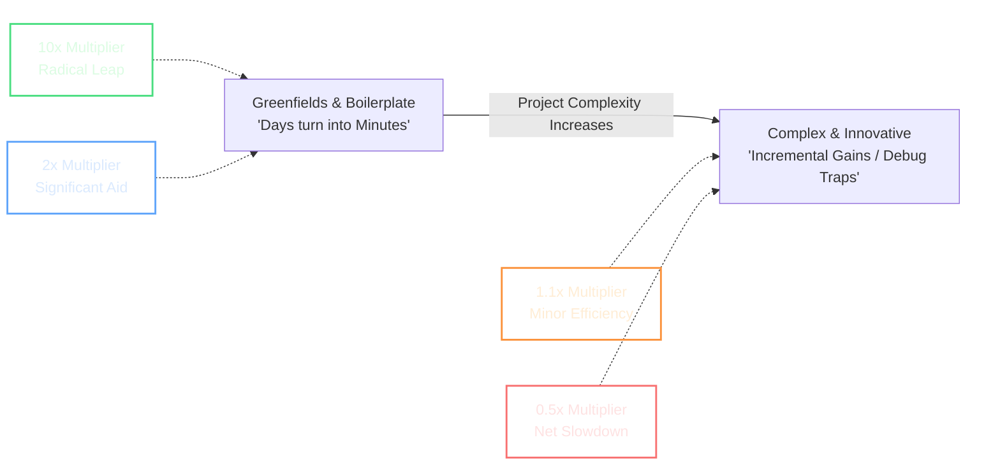

# Week 1, Day 2 (Part 5): Hype vs. Reality & The Frontier Model Landscape

## 1. The Sobering Truth: Hype vs. Reality in Agentic Coding

While AI engines are a massive value add to modern software development, it is critical to separate marketing hype from production engineering realities. The instructor is deeply passionate about the impact LLMs can make, but emphasizes that AI is a powerful productivity multiplier, **not a blanket 10x tool** across all engineering tasks. Its true impact exists on a wide spectrum depending entirely on the project context.

### The Extremes of AI Productivity

### The Game-Changers (Order of Magnitude Faster)

* **The Scenario:** Starting a completely new **greenfields project** or building heavily boilerplate-reliant layers.
* **Concrete Example:** Building a boilerplate React frontend with a clear user interface design and componentry in mind.
* **The Time Compression:** What would take the instructor several weeks, or a great frontend developer an entire day, an LLM can execute in a **matter of minutes**. In this extreme, days truly turn into minutes, and the delivery is an order of magnitude faster.

### The Incremental Gains (The Bottleneck)

* **The Scenario:** Working within massive, complex codebases and highly innovative projects where there is very little cookie-cutter pattern matching.
* **The Reality:** The efficiency gains become highly incremental. LLMs frequently make **subtle, unexpected mistakes** in innovative architectures.
* **The Net Slowdown:** When this happens, you can actually be slowed down because you must expend massive cognitive energy hunting down, rewriting, and debugging the model's subtle code defects.

### Setting the Record Straight

As an aggregate, the instructor considers AI a clear multiplier, but not a universal 10x solution. As software professionals, you must avoid both extremes of the industry spectrum:

1. **The Over-Hype Camp:** People caught up in the hype believing that AI can autonomously handle complex enterprise systems without human validation.
2. **The Anti-AI Camp:** Developers who tried the tools early, got frustrated by the hype or negative experiences, developed "scar tissue," and dismissed the technology entirely.

It is incumbent upon developers to do the practical work, learn the limits of these systems, and maintain a grounded, reasonable opinion—vocalizing exactly where these tools excel and where they still have room to grow.

---

## 2. Industry Benchmarking: `artificialanalysis.ai`

To systematically track which models excel at specific coding tasks, there is an absolute industry de facto standard benchmarking resource that every AI engineer must reference.

> ### 📌 The Ultimate AI Bookmark
> 
> 
> **Resource:** [artificialanalysis.ai](https://artificialanalysis.ai)
> If you have only one bookmark as an AI developer (even if having bookmarks sounds like still using Facebook!), it should be this site. It allows you to dynamically evaluate and compare frontier LLMs across multiple dimensions, including **Intelligence**, **Speed**, and **Price**, as well as specific coding-related and tool-use tests.

---

## 3. What Exactly is a "Frontier" Model?

Before looking at the leaderboard, it is important to define a term used constantly in the industry: **Frontier AI**.

Frontier artificial intelligence refers to the most advanced, capable, and large-scale general-purpose AI models available at any given time. These systems push the boundaries—or the "frontier"—of current AI capabilities in complex areas like reasoning, multimodal understanding, and autonomous task execution. Because they are trained on vast datasets and exhibit unprecedented, highly scalable capabilities, they set the state-of-the-art performance benchmark for the entire industry.

---

## 4. The Current Frontier Model Leaderboard

The AI landscape experienced a massive **point of inflection around November 2025**. This period marked a profound step-change in model capabilities and how much you could trust them. There are still naysayers with scar tissue from how models behaved prior to November 2025; you must encourage them to try again because the models have fundamentally transformed.

When looking at the global **Intelligence Index** (a single encompassing score on Artificial Analysis), the top foundational frontier models typically include:

| Model Engine | Provider | Architectural Standout / Notes |
| --- | --- | --- |
| **GPT-5.2** | OpenAI | Ranked as the single smartest overall model on the global Intelligence Index (the model utilized in yesterday's exercises). |
| **Claude Opus 4.5** | Anthropic | The instructor's personal model of choice. While ranking closely with GPT, its integration inside the **Claude Code** terminal ecosystem makes it uniquely geared towards productive coding. |
| **GPT-5.2 Codex** | OpenAI | A specialized engineering variant of the core GPT-5.2 model, tuned specifically for code generation and syntax parsing. |
| **Gemini 3 Pro** | Google | Google's premier foundational engine, powering the **Antigravity** wrapper. It scores exceptionally well and boasts the industry's largest capacity limits. |
| **GLM-4.7** | Z.AI | An open-source model developed by the Chinese AI startup Z.AI. It scores remarkably high on specialized benchmark tests for coding and **tool calling**. |

---

## 5. The Intelligence Trajectory: 2026 Predictions

If you look at the chart tracking frontier model intelligence over time on Artificial Analysis, it shows a steep, upward curve that looks almost spooky.

* **The Cause of the Slope:** The instructor believes the recent massive surge in capabilities was driven by specific "bumps" in technology, namely the deployment of new reasoning techniques.
* **The 2026 Prediction:** The instructor predicts that **this sharpening slope will not continue to steepen indefinitely**. While we will see continuous, clear improvements this year, the trajectory is moving toward a more incremental growth curve rather than a continuous vertical line. Because models change so rapidly, your live look at the index will likely feature even stronger engines than the ones listed today.

