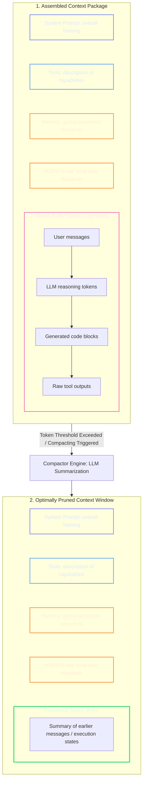
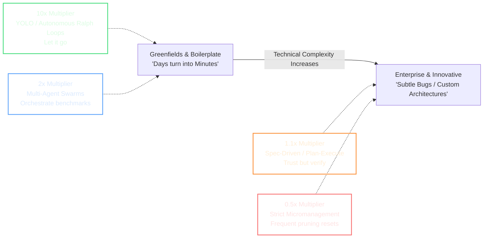

# Week 1, Day 2: Master Dashboard — AI Basics, Context Engineering & Agentic Workflows

This master hub synthesizes the entire curriculum for **Week 1, Day 2**. Each section below provides a concise, high-signal summary of the architectural and workflow paradigms covered, paired with the direct repository paths to the complete reference sheets.

---

## 📁 Repository Index & Core Sub-Modules

### 1. AI Basics & Mechanics

* **Summary:** Breaks down Large Language Models as autoregressive, token-by-token text-prediction engines. Explains the critical architectural division between the stateless **LLM (The Brain)** and the stateful **AI Application (The Wrapper)**, alongside the four foundational software tricks used to give agents the illusion of state, human-like reasoning, and outside-world capabilities.
* **Complete Reference Sheet:** [01_AI_Basics.md](https://github.com/nirajp82/AICoder/blob/main/02/01_AI_Basics.md)

### 2. Context Engineering

* **Summary:** Documents the industry-wide shift from Prompt Engineering (isolated micro-phrasing) to Context Engineering (macro-management of the total token environment). Analyzes the 5 core layers of an active token payload, the mathematical $N^2$ degradation of self-attention mechanisms, and how automated compacting middleware prevents context distraction.
* **Complete Reference Sheet:** [02_ContextEngineering.md](https://github.com/nirajp82/AICoder/blob/main/02/02_ContextEngineering.md)

### 3. The Project Memory File (`agents.md`)

* **Summary:** Details the mechanics of utilizing structured markdown configurations (`agents.md`, `claude.md`, or `gemini.md`) as persistent project anchors. Explains the backwards-resolution folder hierarchy where innermost files override parent directories, and provides concrete strategies for counteracting native LLM anti-patterns (such as wordy READMEs and over-defensive programming blocks).
* **Complete Reference Sheet:** [03_MemoryFile.md](https://github.com/nirajp82/AICoder/blob/main/02/03_MemoryFile.md)

### 4. The Evolution of AI Workflows

* **Summary:** Maps out the 6 operational developer-agent workflows, contrasting the control-heavy **2025 Mindset** (Micromanagement; Plan/Execute Loops; Spec-Driven Development) against the completely autonomous **2026 Mindset** (YOLO Mode; Multi-Hour self-correcting Ralph Wiggum Loops; Multi-Agent Orchestration Swarms).
* **Complete Reference Sheet:** [04_Workflows.md](https://github.com/nirajp82/AICoder/blob/main/02/04_Workflows.md)

### 5. Hype vs. Reality & The Frontier Landscape

* **Summary:** Outlines a grounded engineering view of AI productivity gains—demonstrating where agents provide a 10x order-of-magnitude leap (greenfields boilerplate) versus where they yield highly incremental loops (complex enterprise codebases). Introduces `artificialanalysis.ai` for benchmarking the absolute smartest **Frontier AI Models** on specialized tool-calling and coding indexes.
* **Complete Reference Sheet:** [05_HypVsReality_FrontierModelLandscape.md](https://github.com/nirajp82/AICoder/blob/main/02/05_HypVsReality_FrontierModelLandscape.md)

---

## 🗺️ Architectural Visual Reference Maps

### The Live Context Package Stack & Compacting Lifecycle

When an agent fires a tool call, the application wrapper compiles the entire session history into a single stack. If this history exceeds optimal token limits, context compacting collapses volatile conversation memory into a dense semantic summary block.

---

### The Workflow Decision Matrix

Your engineering strategy should adjust dynamically based on your specific project profile and underlying risk tolerances.

---

## 🎯 Day 2 Core Axiom

> **The Developer's Golden Rule:** Large Language Models are tools to drastically accelerate execution, but **accountability cannot be delegated**. It is your ultimate technical responsibility to select the appropriate context strategy, validate all generated architectures, check edge cases, and ensure code is fully proven to work. Use AI in anger, but maintain complete ownership over the code you ship.
