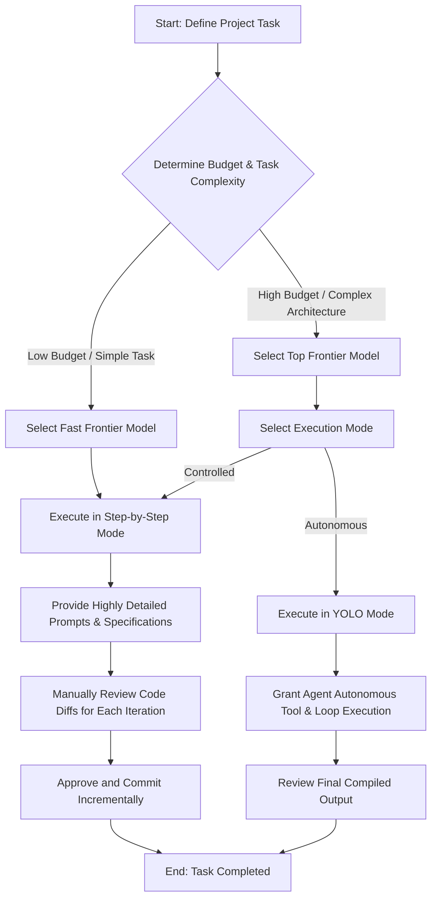
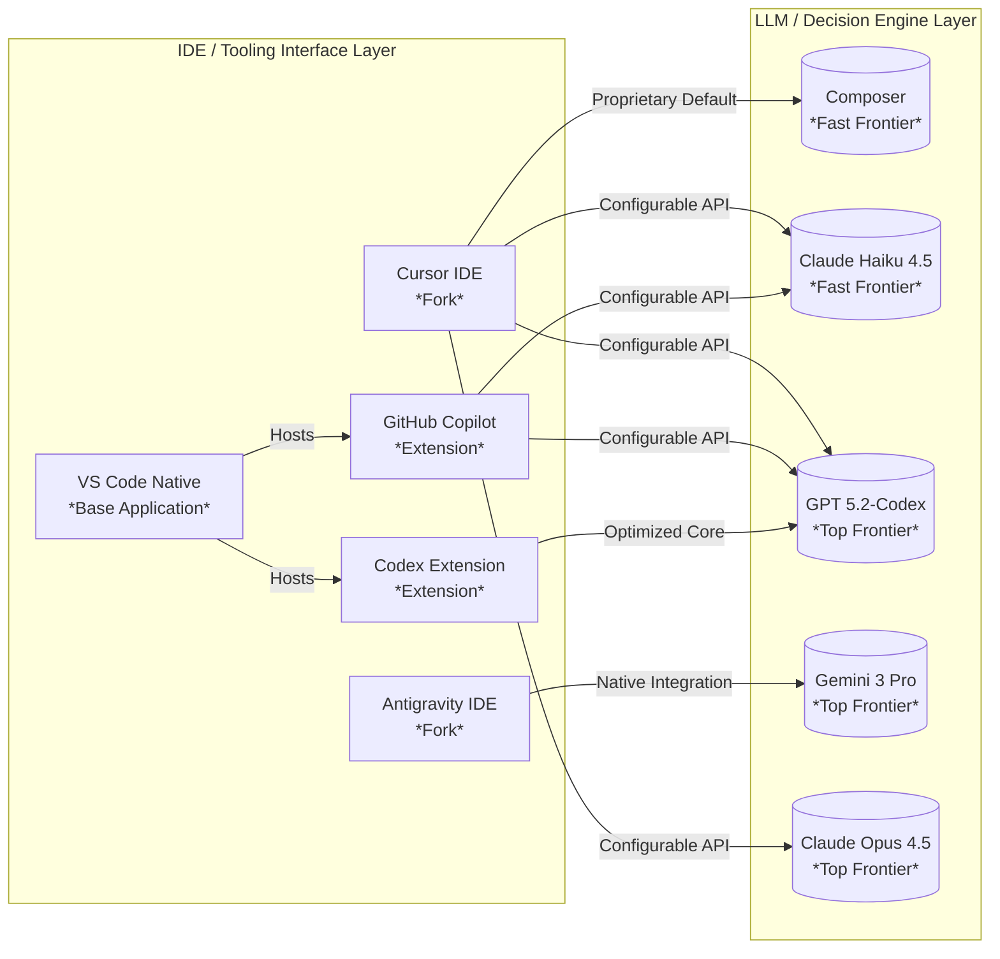

# Week 1, Day 4: AI Coding Tools Recap & YOLO Mode Selection

## Overview

This chapter provides a comprehensive review of four leading AI-integrated Development Environments (IDEs) and plugins (Cursor, GitHub Copilot, Codex, and Antigravity) alongside the primary Large Language Models (LLMs) that power them. It establishes a critical framework for distinguishing between the user interface toolset and the underlying intelligence engine. Finally, it outlines practical strategies for selecting models based on budget, complexity, and execution style—specifically comparing disciplined, step-by-step iterations against autonomous "YOLO" mode execution.

---

## Why This Matters

In production AI-assisted engineering, selecting the wrong model-tool pairing leads to broken codebases, endless debugging loops, and wasted capital. Understanding whether a tool is a standalone fork or an extension determines your environment's customization limits. More importantly, recognizing the architectural trade-offs between "fast frontier" models (low latency, lower context) and "top frontier" models (high reasoning, deep context) allows you to properly match an AI agent's capability to the complexity of the engineering task at hand.

---

## Key Concepts

* **IDE Architecture Differences:** The distinction between an IDE built as a standalone fork of an open-source codebase (e.g., VS Code) versus a traditional extension injected into a native application.
* **Intelligence Tooling Separation:** Decoupling the user interface layer (the IDE or agentic platform) from the decision-making layer (the LLM engine).
* **Frontier Model Classification:** Categorizing AI models into "fast frontier" (optimized for speed and low cost) and "top frontier" (optimized for deep reasoning, complex logic, and massive context retention).
* **Execution Modes:** Operating in "Step-by-Step" mode (requiring micro-approvals and precise diff inspection) versus "YOLO" mode (granting autonomous, looping tool execution to a high-tier model).

---

## Detailed Notes

### Forked IDEs vs. IDE Extensions

#### Simple Explanation

Think of your code editor as a car. A "forked IDE" means a company took the blueprints of a popular car, built their own factory version of it, and pre-installed special high-tech features inside the dashboard. An "IDE extension" is like keeping your original factory car but buying an add-on dashboard accessory that you plug into the lighter socket. Both give you new features, but one is an entirely separate vehicle.

#### Technical Explanation

VS Code is open-source software managed under the MIT license, allowing organizations to copy and modify the source repository into an independent lineage, known as a fork. Standalone applications like Cursor (by AnySphere) and Antigravity (by Google) are direct downstream forks of VS Code. They modify core editor behaviors to embed agentic loops natively. Conversely, tools like GitHub Copilot and Codex operate as standard extensions via the VS Code Extension API, communicating with external LLM servers through standard web protocols without altering the underlying core application binary.

#### Example

Opening Cursor runs an entirely independent binary application (`cursor.app`) that does not share active process spaces with an official VS Code installation, whereas installing the GitHub Copilot extension requires the official VS Code binary (`code`) to handle execution.

#### Analogy

A kitchen transformation: A forked IDE is a fully custom-remodeled kitchen built from the ground up around a professional chef's stove. An extension is buying a high-end air fryer and plugging it into your existing countertop outlet.

---

### Fast Frontier vs. Top Frontier Models

#### Simple Explanation

Fast frontier models are like lightning-fast junior developers. They write code rapidly and are cheap to employ, but if you give them a massive, complicated task without watching them, they will make mistakes and create a mess. Top frontier models are like seasoned principal engineers. They take a little longer to think and cost more money, but they can comprehend massive amounts of information at once and handle complex problems completely on their own.

#### Technical Explanation

LLMs are segmented by parameter size, optimization targets, and context capabilities. Fast frontier models (e.g., Composer, Claude Haiku 4.5) emphasize minimized time-to-first-token (TTFT) and lower inference costs, operating over standard context windows (typically 200,000 tokens). Top frontier models (e.g., GPT 5.2-Codex, Gemini 3 Pro, Claude Opus 4.5) deploy larger parameter weights or advanced mixture-of-experts (MoE) architectures. This allows them to manage complex structural dependencies and expansive context windows—reaching up to 1,000,000 tokens in the case of Gemini—enabling them to digest an entire repository's architecture simultaneously.

#### Example

When executing an agent loop across a multi-layered repository with 50 interdependent source files, a fast frontier model may lose track of distant architectural references, resulting in fragmented code edits. A top frontier model maintains the state of all files across its expansive context window to generate accurate, unified modifications.

#### Analogy

Using transport services: A fast frontier model is like a courier on a nimble motorcycle through city traffic—ideal for quick, small deliveries. A top frontier model is a heavy-duty cargo plane—more expensive to fuel and slower to launch, but capable of moving massive, highly complex payloads across long distances safely.

---

## Workflow

The diagram below details the operational decision path an engineer takes when analyzing a project task, selecting the appropriate model tier, and executing the corresponding workflow.



---

## Architecture Diagram

This component diagram highlights how the application interface layer (IDEs) communicates across API boundaries to engage specific foundational models.



---

## Step-by-Step Process

### Configuring Your Environment for Autonomy vs. Control

1. **Audit the Codebase Scale:** Calculate your approximate repository token count. If the codebase exceeds 150,000 tokens, eliminate models with smaller context limits from your configuration.
2. **Isolate the LLM Core:** Open your chosen IDE settings (e.g., Cursor developer settings or Copilot extension panel). Explicitly toggle off "Auto-Select Model" if you require guaranteed top-frontier reasoning.
3. **Select the Model Core:**
* Choose **GPT 5.2-Codex** or **Claude Opus 4.5** for intricate logic restructuring.
* Choose **Gemini 3 Pro** if you must load a massive history of logs, documentation, and source code frameworks simultaneously.


4. **Deploy System Safeguards (If using Fast Frontier):** Create or update your codebase rules document (e.g., `.agents/.rules` or `agents.md`) to restrict autonomous file writes.
5. **Initiate Execution:**
* **For Step-by-Step:** Enter your prompt instruction and remain at the console to inspect each generated line modification.
* **For YOLO Mode:** Verify your workspace backups or git state, input the comprehensive prompt instruction, and allow the agentic platform to run its execution loop until the target goal evaluates as true.


---

## Commands and Examples

### Model Architecture Reference Matrix

| Feature | Composer | Claude Haiku 4.5 | GPT 5.2-Codex | Gemini 3 Pro |
| --- | --- | --- | --- | --- |
| **Provider** | AnySphere (Cursor) | Anthropic | OpenAI / Codex | Google |
| **Model Class** | Fast Frontier | Fast Frontier | Top Frontier | Top Frontier |
| **Context Window** | 200,000 tokens | 200,000 tokens | 272,000 tokens | 1,000,000 tokens |
| **Best Used For** | Fast, local edits | Rapid prototyping | Heavy code logic | Massive codebases |

### Example System Instructions for Fast Frontier Enforcement

When using lower-tier models, append rigorous constraints to your prompt files to avoid code degradation:

```markdown
# Agent Execution Rules for Fast Frontier Models
- Do NOT rewrite entire files to change a single function.
- Output precise code diffs only.
- Stop the execution loop and request human review before altering external dependencies.
- Run test suites after every single file modification.

```

---

## Best Practices

* **Value Intelligence Over Speed:** Prioritize high-quality, deeply reasoned model outputs. Saving seconds during token generation often leads to hours of tracking down edge-case bugs.
* **Match Model Tier to Execution Scope:** Reserve YOLO mode strictly for top frontier models like GPT 5.2-Codex, Gemini 3 Pro, or Claude Opus 4.5.
* **Budget Realistically for Complexity:** Allocate an explicit operational budget for premium models. Opting for a cheaper model to save money frequently backfires due to the high volume of corrective iterations needed.
* **Audit Diff Files Regularly:** Maintain a strict habit of inspecting codebase file variations (`git diff`) after an AI agent completes a loop.

---

## Common Mistakes

* **YOLOing with Fast Frontier Models:** Allowing an unmonitored fast frontier or low-end open-source model to run autonomously. This frequently ends with a broken codebase full of syntactical errors.
* **Confusing the IDE with the Model Engine:** Assuming that changing from Cursor to VS Code will inherently fix a logic bug. The interface (IDE) only wraps the tool; the underlying model engine handles the actual engineering logic.
* **Using Insufficient Prompts on Smaller Models:** Providing broad, brief instructions to small or open-source models without giving precise system specifications.

---

## Pro Tips

* **Toggle Auto-Select Off for Large Tasks:** IDEs often route queries to lower-tier fast models when set to "Auto Mode" to save their own server costs. Force-select your top frontier model when executing high-risk refactoring jobs.
* **Leverage Gemini's Context Window for Legacy Transfers:** When migrating older systems to modern frameworks, pass the entire old repository, documentation logs, and testing suites straight into Gemini 3 Pro's 1-million token window to eliminate contextual blind spots.

---

## Real-World Use Cases

* **Autonomous Microservice Scaffolding (YOLO Mode):** A senior engineer provides a system specification document to Claude Opus 4.5 running within an agentic platform. The model builds out the database schemas, API routes, and validation layers autonomously without human intervention.
* **Rapid Component Text Styling (Fast Frontier Mode):** A frontend developer utilizes Cursor running Composer to quickly generate 20 repetitive UI layout components. The developer uses step-by-step mode to rapidly accept modifications inline.

---

## Key Takeaways

* **Tool vs. Brain:** IDEs (Cursor, Copilot, Codex, Antigravity) act as the tool wrappers. The LLMs (Composer, Haiku, GPT, Gemini) act as the operational brain.
* **Context Matters:** Top frontier models provide larger context spaces and stronger logical capabilities, reducing long-term time and resource expenditures.
* **Control Your Autonomy:** Use micro-step strategies for faster, lower-cost models, and reserve complete automation (YOLO mode) for high-reasoning frontier models.

---

## Glossary

* **Fork:** A copy of an open-source project's source code that undergoes independent development, creating an entirely separate software ecosystem.
* **Extension:** A software component or plugin added to an existing application that extends its native capabilities without changing the base application binary.
* **Fast Frontier Model:** A classification of modern LLMs engineered specifically for high speed, low latency, and cost-efficient processing.
* **Top Frontier Model:** A premier class of LLMs optimized for deep reasoning, extensive logic handling, and handling high volumes of contextual tokens.
* **YOLO Mode:** An industry phrase describing a workflow where an AI agent receives complete autonomy to run iterative code creation, tool handling, and system writing loops without pausing for human verification.
* **Context Window:** The maximum volume of combined text data (measured in tokens) an LLM can parse and evaluate during a single API interaction.

---

## Revision Notes

### The AI Engineering Blueprint

* **IDE Variants:** Cursor / Antigravity (Standalone Forks) | Copilot / Codex (VS Code Extensions).
* **Speed Selection:** Fast Frontier (Low cost, fast, requires baby steps and diff tracking).
* **Reasoning Selection:** Top Frontier (Higher cost, deep context, reliable for automated looping).
* **The Golden Rule:** Always prioritize intelligence over generation speed to minimize bug-tracking loops.

---

## Interview Questions

### Q1: What is the structural difference between a forked IDE like Cursor and an extension like GitHub Copilot?

**Answer:** A forked IDE is a completely independent development environment compiled from a copy of an open-source codebase (such as VS Code), giving developers deep control over UI customization and native process loops. An extension is a modular addon built using an editor's public API. It runs entirely inside the host environment without altering the underlying core system framework.

### Q2: Why is it risky to run an autonomous "YOLO" development loop using a fast frontier model?

**Answer:** Fast frontier models prioritize speed and cost efficiency over deep contextual reasoning. When granted complete loop autonomy over complex assignments, their lower reasoning capabilities often cause them to miss architectural relationships. This results in compound logic errors and broken code structures.

### Q3: Under what scenario would Gemini 3 Pro be favored over a model with higher individual code-generation accuracy but a smaller context window?

**Answer:** Gemini 3 Pro is highly favored when working with massive codebases or extensive diagnostic logs because of its 1-million token context window. Even if alternative models display slightly sharper isolated generation accuracy, they cannot parse massive repository depths simultaneously, which leads to fragmented updates.

---

## Practice Exercises

### Exercise 1: Model Categorization Challenge

Review the following real-world engineering tasks. Decide whether you should assign them to a **Fast Frontier Model (Step-by-Step)** or a **Top Frontier Model (YOLO Mode)**. Write down a short sentence explaining your choice for each.

1. Adding basic input validation logic to a simple login form component.
2. Refactoring a legacy monolithic application into an asynchronous microservice architecture across 30 files.
3. Scanning a newly generated API script file to fix direct typos and styling syntax.

### Exercise 2: Building an Agent Directive

Draft a concise custom `.agents/.rules` configuration file that explicitly restricts a fast frontier model from making unauthorized edits to your production database schema file (`/src/db/schema.ts`). Ensure your directive mandates manual developer confirmation for any changes in that specific directory.
