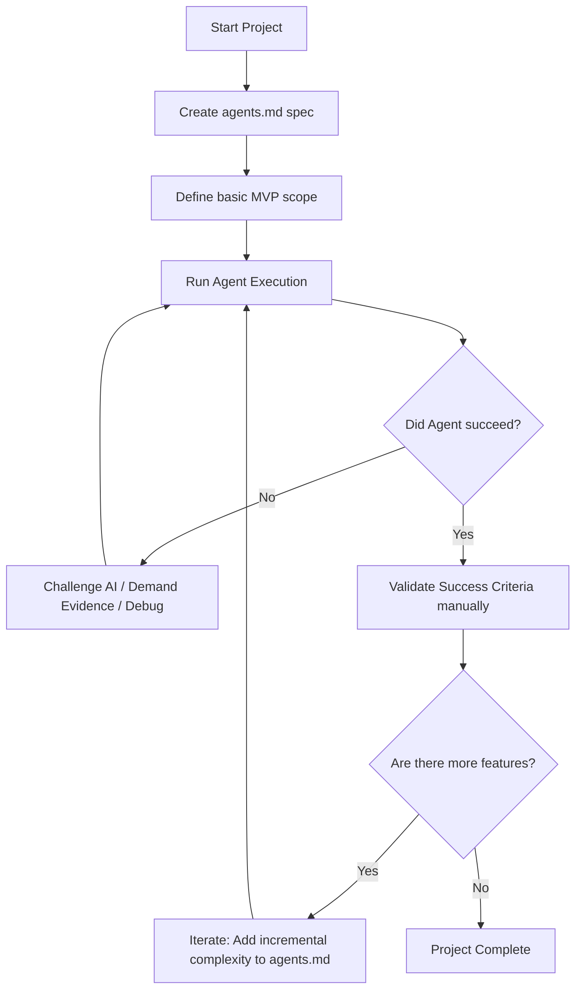
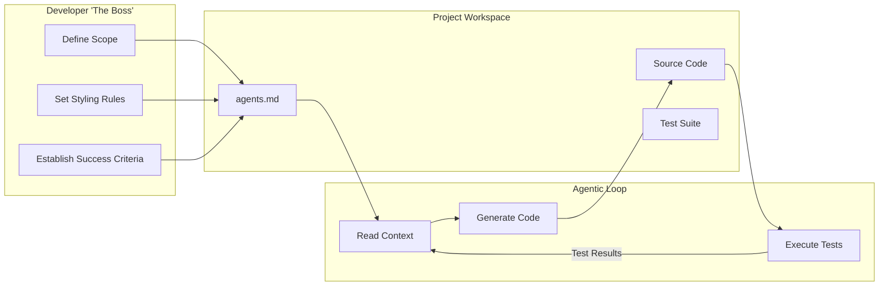

# Principles of Vibe Coding & Agentic Engineering

## Overview

This chapter explores the foundational principles of effective "vibe coding" and AI agentic engineering. It emphasizes taking a disciplined, "be the boss" approach over blindly trusting AI (YOLO mode). The lesson also covers how junior versus senior developers should adapt their learning mindsets when using these tools and provides a realistic breakdown of the productivity gains you can actually expect.

## Why This Matters

AI coding agents are powerful but imperfect. Allowing an agent to operate entirely unchecked leads to massive context drift, compound errors, and unmaintainable code. Mastering these structured principles ensures you harness the speed of AI while maintaining strict architectural control, ensuring that code generated by AI is reliable, testable, and genuinely accelerates your delivery without incurring hidden technical debt.

## Key Concepts

* **The "Be the Boss" Mentality:** Treating the AI as an eager but naive junior developer who requires strict instructions, clear success criteria, and rigorous verification.
* **Structured `agents.md`:** A core configuration and specification file that guides the AI on project goals, coding style, and definitions of success.
* **Incremental Complexity:** Starting with simple Minimum Viable Products (MVPs) and slowly increasing scope, rather than attempting to build entire systems in one shot.
* **Junior vs. Senior Utilization:** How varying experience levels must interact with agents—juniors for learning through questioning, and seniors for architectural scaling.
* **The 10X Reality Check:** Understanding that while AI can provide massive 10X boosts on Greenfield or boilerplate tasks, it may only offer marginal gains—or even negative value—on complex legacy or un-trained problems.

## Detailed Notes

### The "Be the Boss" Framework

**Simple Explanation**
Don't let the AI drive the car while you sleep. You are the manager, and the AI is a fast but sometimes confused intern. You have to tell it exactly what to do, how you want it done, and how to prove to you that it finished the job correctly.

**Technical Explanation**
The "Be the Boss" framework mandates strict orchestration over Large Language Model (LLM) agents. Because autoregressive models are prone to hallucination, context degradation, and assumption-making, developers must enforce deterministic guardrails. This involves utilizing a comprehensive `agents.md` specification file that dictates scope constraints, stylistic linting rules, and rigid validation criteria before the agent is permitted to commit state changes.

**Example**
Instead of prompting, "Build a login page," you define an `agents.md` that states: "1. Implement a React login component. 2. Use Tailwind CSS for styling. 3. Success is defined when the component passes all Vitest assertions for valid email parsing and rejects empty passwords."

**Analogy**
Think of the AI as a high-speed construction crew. If you just say "Build me a house," they might build it upside down. You must provide a precise blueprint, inspect the foundation before they build the walls, and sign off on the plumbing before they seal it up.

---

### Junior Learning vs. Senior Scaling

**Simple Explanation**
If you are new to coding, don't let the AI do all your homework for you, or you won't learn anything. Ask it to explain *why* it wrote the code. If you are an experienced coder, use the AI to do the boring, repetitive tasks (like setting up servers) so you can focus on building cool systems faster.

**Technical Explanation**
For junior engineers, heavy reliance on agentic generation bypasses the acquisition of foundational mental models and debugging heuristics necessary for long-term engineering growth. Juniors should utilize agents primarily as interactive tutors via Socratic prompting. Senior engineers possess the requisite architectural context to validate AI outputs instantly; thus, they can leverage agents to orchestrate broad cross-stack implementations (e.g., scaffolding Terraform, complex DevOps pipelines) that abstract away syntax execution in favor of rapid system design.

**Example**
A junior developer sees a complex SQL join generated by the AI and asks, "Explain step-by-step how this LEFT JOIN handles null values." A senior developer uses the AI to instantly scaffold out 50 lines of boilerplate boilerplate Next.js routing, verifies it by skimming, and moves on to business logic.

**Analogy**
Using a calculator: A 3rd grader needs to learn long division by hand first before using the calculator, otherwise they won't understand math. An accountant already knows the math and uses the calculator to process hundreds of tax returns in a day.

---

### The Reality of AI Productivity

**Simple Explanation**
AI won't magically make you 10 times faster at everything. Sometimes it does a week's worth of easy work in an hour. Other times, it messes up a hard problem so badly that it takes you longer to fix its mistakes than if you had just written the code yourself.

**Technical Explanation**
Productivity multipliers from LLM coding agents follow a non-linear curve based on problem novelty and contextual constraints. "Greenfield" projects (new apps with standard frameworks) reside heavily in the model's training data distribution, yielding near-10X output speeds. "Brownfield" tasks (legacy codebases, niche proprietary APIs, or undocumented libraries) fall outside the latent space distribution, often resulting in hallucinated syntax, cyclical debugging loops, and net-negative productivity.

**Example**
Building a standard Kanban board UI in React might take 5 minutes with AI instead of 3 days. However, writing a custom streaming HTTP Model Context Protocol (MCP) server—a highly specific, novel task—might take the AI in circles, requiring the developer to step in and write it manually.

**Analogy**
Driving on a highway versus navigating a dense jungle. On a well-paved highway (common coding tasks), the AI cruise control can comfortably drive at 100mph. In an unmapped jungle (custom/legacy code), the AI will crash into trees, and you have to take the steering wheel.

---

## Workflow



## Architecture Diagram



## Step-by-Step Process

1. **Initialize the Repository:** Create your standard project folders.
2. **Draft the `agents.md`:** Write a concise document outlining the specific tasks, coding style, and exact definitions of success.
3. **Start Simple:** Constrain the first agent prompt to a Minimum Viable Product (MVP). Do not ask for the entire application at once.
4. **Execute and Monitor:** Allow the AI to run, but maintain a high degree of skepticism.
5. **Demand Evidence:** If the AI claims a bug is fixed, ask it to output the test logs or explain the root cause clearly before accepting the code.
6. **Iterate:** Once the simple MVP is validated, expand the `agents.md` with the next layer of complexity.
7. **Refine Context:** If the AI repeats an error, explicitly ban that behavior in the `agents.md` and force the AI to acknowledge it.

## Commands and Examples

### Example `agents.md` Layout

```markdown
# Project: User Authentication MVP

## 1. Specification
Build a basic React login form component with email and password fields.

## 2. Style Requirements
- Use functional components and React Hooks.
- Use Tailwind CSS for simple styling.
- Do NOT use class components.

## 3. Success Criteria
- The form must render without console errors.
- Submitting an empty password must display a red error message.
- The component must pass the basic Vitest rendering test.

```

## Best Practices

* **Keep `agents.md` Concise:** Large, rambling instruction files confuse the AI context window. Keep rules modular and direct.
* **Trust, but Verify:** Allow the AI to attempt a task, but thoroughly review the diffs and test results before moving forward.
* **Force Socratic Learning (for Juniors):** Explicitly prompt the AI with: `"Explain the logic you just wrote line-by-line so I can learn."`

## Common Mistakes

* **Boiling the Ocean:** Asking the AI to build a massive, complex application in a single prompt.
* **Getting Lazy (YOLO trap):** Letting your guard down after a few early successes and letting the AI run unmonitored for hours.
* **Accepting Confident Nonsense:** Believing the AI when it boldly claims it fixed a bug, without verifying the actual logs.

## Pro Tips

* **The "Performance Report" Trick:** If an AI keeps making the same mistake, instruct it in the prompt to write a "performance report" explaining why it failed and mandate that it reads this report before writing any new code.
* **Trade-off Awareness:** Accept that AI will take away the joy of writing simple syntax, but gives back the joy of instantly deploying massive architectural systems (like frontends or DevOps pipelines).

## Real-World Use Cases

* **Scaffolding Greenfield Projects:** Instantly generating boilerplate code, routing, and standard UI components for a brand new Next.js application.
* **Automating DevOps:** Having the agent write repetitive Terraform deployment scripts or Dockerfiles that would normally require looking up extensive documentation.
* **Rapid Prototyping:** Building a functional, interactive concept (like a Kanban board) in minutes to show a client, rather than spending days coding it manually.

## Key Takeaways

* Effective AI coding requires treating the LLM like an employee that needs strict management, not a magical autopilot.
* The core tool for this management is a well-structured `agents.md` file governing specs, style, and success metrics.
* Avoid the YOLO mentality; incremental progress with constant testing prevents massive time sinks.
* Productivity gains vary wildly: expect 10X speed on simple/new tasks, but potentially 0.5X speed on complex, undocumented legacy tasks.

## Glossary

* **Vibe Coding:** A modern slang term for writing code via natural language prompts and iteratively guiding the AI based on how the output "feels" or behaves.
* **agents.md:** A foundational markdown file placed in a repository that provides global instructions, styling rules, and context to AI coding assistants.
* **MVP (Minimum Viable Product):** The simplest, most basic version of a feature or application that functions enough to be tested.
* **Greenfield Project:** Developing a brand new system from scratch with no legacy code to maintain or integrate with.
* **Brownfield Project:** Developing software in an environment that already contains legacy systems and established codebases.
* **YOLO (You Only Look Once):** In AI engineering, the risky practice of giving an agent broad instructions and letting it run completely unmonitored.

## Revision Notes

* **Core Principle:** "Be the Boss" — Direct, verify, and challenge the AI.
* **Tooling:** Use `agents.md` to define Spec, Style, and Success.
* **Strategy:** Start simple (MVP), iterate in sub-steps, avoid boiling the ocean.
* **Expectations:** Greenfield = High speed up. Complex/Legacy = Incremental or negative speed up.
* **Growth:** Juniors must ask "why" to learn; Seniors should utilize AI to scale system building.

## Interview Questions

### Q1: Why is it dangerous to immediately "YOLO" a complex application using an AI coding agent?

**Answer:** Because AI models are prone to hallucination and context drift. If left unmonitored on a complex task, the AI will likely make incorrect assumptions early in the process. By the time you review the code hours later, you will have a massive pile of unworkable, tangled logic that takes longer to untangle than if you had written it yourself incrementally.

### Q2: What are the three essential components that should be included in a strong `agents.md` file?

**Answer:** A strong `agents.md` must include: 1) A clear specification of what needs to be done, 2) The specific coding style or conventions to adhere to, and 3) The exact criteria required to gauge and prove success.

### Q3: How should a junior developer's use of AI coding agents differ from a senior developer's use?

**Answer:** A junior developer should use the AI as an interactive tutor, heavily prompting it to explain the code it generates so they can learn foundational concepts and build mental models. A senior developer, who already has these mental models, can use the AI for rapid architectural execution and scaffolding, trading the manual writing of syntax for the speed of building entire systems.

## Practice Exercises

### Exercise 1: Drafting the Rules

Write a basic 10-line `agents.md` file for a simple task: Creating a Python script that reads a CSV file and prints the total number of rows. Ensure you include a Spec, Style rule, and Success Criteria.

### Exercise 2: The Socratic Prompt

Imagine an AI just generated a regular expression (`/^[^\s@]+@[^\s@]+\.[^\s@]+$/`) to validate an email. Write the exact prompt you would use as a junior developer to ensure you learn how this code works, rather than just copy-pasting it.
