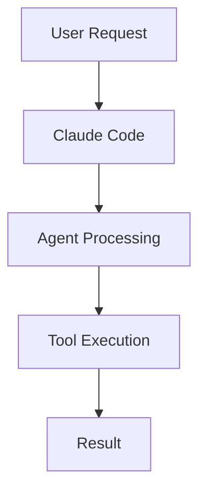

# Prompt: Convert Course Transcript into a GitHub README Learning Guide

I am taking the Udemy course:

**"AI Coder: Complete Claude Code & Coding Agents Course"**

I want you to act as an expert technical writer, educator, and documentation specialist.

Your task is to convert the course transcript that I provide into a **professional GitHub README-style learning document** that I can use as my personal study notes and reference guide.

## Goals

Create documentation that is:

* Beginner-friendly
* Easy to understand
* Written in simple language
* Well-structured and organized
* Suitable for future reference
* Practical and actionable
* Formatted in GitHub Markdown
* Enhanced with diagrams, flowcharts, tables, and visual explanations whenever helpful

---

# Output Requirements

Generate a complete README section using the following structure:

```markdown
# Chapter Title

## Overview
Provide a short summary of what this chapter teaches.

## Why This Matters
Explain why this concept is important in real-world AI development.

## Key Concepts
List and explain all important concepts covered in the chapter.

## Detailed Notes
Create detailed explanations using simple language.

### Concept 1
Explanation

### Concept 2
Explanation

## Workflow
Show the process as a flowchart.

## Architecture Diagram
Create a Mermaid diagram if applicable.

## Step-by-Step Process
Provide numbered steps.

## Commands and Examples
Include all commands, code snippets, prompts, and examples from the lesson.

## Best Practices
List recommended approaches.

## Common Mistakes
List common errors beginners make.

## Pro Tips
Include advanced tips and shortcuts.

## Real-World Use Cases
Explain where this is used in production.

## Key Takeaways
Provide a concise summary.

## Glossary
Define important terms.

## Revision Notes
Create a quick-review cheat sheet.

## Interview Questions
Generate possible interview questions and answers.

## Practice Exercises
Create exercises to reinforce learning.
```

---

# Documentation Rules

1. Do NOT simply summarize.
2. Expand concepts when needed.
3. Fill knowledge gaps using industry best practices.
4. Explain technical terms in simple language.
5. Use examples whenever possible.
6. Use tables for comparisons.
7. Use bullet points for readability.
8. Use emojis sparingly to improve scanning.
9. Keep explanations concise but complete.
10. Make the document useful even months later.

---

# Diagram Requirements

Whenever applicable, generate Mermaid diagrams.

Example:



Create additional diagrams if they improve understanding:

* Architecture diagrams
* Sequence diagrams
* Workflow diagrams
* Decision trees

---

# Learning Enhancement

For every major topic include:

### Simple Explanation

Explain as if teaching a beginner.

### Technical Explanation

Explain for developers.

### Example

Provide practical examples.

### Analogy

Use a real-world analogy when useful.

---

# Formatting Requirements

* Use GitHub Markdown.
* Use proper headings (H1, H2, H3).
* Use code blocks for commands and code.
* Use tables for comparisons.
* Use Mermaid diagrams for visualizations.
* Use callout sections where helpful.

Example:

> 💡 Tip: Important insight here.

> ⚠️ Warning: Common mistake here.

---

# Transcript

Analyze the following transcript and create the README document:

[PASTE TRANSCRIPT HERE]
